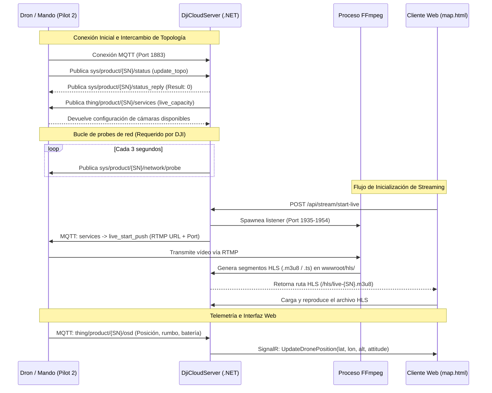

```markdown
# 📋 Documento de Relevo (Handover) - dji_cloud

Este repositorio contiene la implementación de un backend y servidor de telemetría y vídeo compatible con la especificación **DJI Cloud API (v1.11.x)**. El propósito principal del proyecto es servir como un servidor centralizado para drones empresariales de DJI (como las series Matrice 30/30T, Matrice 300/350 RTK, Mavic 3 Enterprise y los sistemas de hangar DJI Dock / Dock 2) que utilicen la aplicación **DJI Pilot 2**. 

El servidor aloja un broker MQTT embebido para la comunicación directa con las aeronaves y mandos, expone una API REST para la gestión de misiones (KML/KMZ), telemetrías y transmisiones, realiza transcodificación de vídeo RTMP a HLS en tiempo real utilizando FFmpeg, y retransmite datos de posicionamiento al instante a través de WebSockets (SignalR) a un panel de control con un mapa interactivo.

---

## 1. 🚀 Arquitectura y Stack Tecnológico

### Tecnologías Principales
*   **Backend:** [.NET 10.0 (C#)](file:///e:/gdrive/dji_cloud/src/DjiCloudServer/DjiCloudServer.csproj) como entorno de ejecución y ASP.NET Core como framework web.
*   **Servidor MQTT:** [MQTTnet (v4.3.7.1207)](file:///e:/gdrive/dji_cloud/src/DjiCloudServer/DjiCloudServer.csproj#L24-L26) y su extensión ASP.NET Core, configurado como broker embebido de alto rendimiento.
*   **Transcodificación de Vídeo:** Spawneo y control de procesos nativos de [FFmpeg](file:///e:/gdrive/dji_cloud/src/DjiCloudServer/Services/FfmpegService.cs) para la recepción de flujos RTMP y segmentación a HTTP Live Streaming (HLS).
*   **Comunicación en Tiempo Real:** [ASP.NET Core SignalR](file:///e:/gdrive/dji_cloud/src/DjiCloudServer/Hubs/TelemetryHub.cs) para la propagación reactiva de eventos y telemetrías al navegador.
*   **Frontend:** Interfaz estática vanilla en [wwwroot/](file:///e:/gdrive/dji_cloud/src/DjiCloudServer/wwwroot) (HTML5, CSS y JavaScript moderno) apoyada en librerías vía CDN como Leaflet.js para el mapa y hls.js para la reproducción de vídeo.
*   **Instalador y Servicio Windows:** [Inno Setup 6](file:///e:/gdrive/dji_cloud/installer/DjiCloudServer.iss) para empaquetar la aplicación autocontenida como un servicio del sistema Windows.

### Patrones de Diseño y Arquitectura
*   **Arquitectura Orientada a Eventos (Event-Driven):** La interacción principal se genera mediante la escucha activa e interceptación de paquetes MQTT. Los datos recibidos de los drones se procesan en background y se retransmiten a los clientes web a través de eventos de SignalR.
*   **Servicios Inyectados como Singletons:** Servicios críticos para el almacenamiento en caché del estado del sistema ([AdminDataService](file:///e:/gdrive/dji_cloud/src/DjiCloudServer/Services/AdminDataService.cs)), almacenamiento temporal de trayectorias ([TrajectoryStore](file:///e:/gdrive/dji_cloud/src/DjiCloudServer/Services/TrajectoryStore.cs)), control de procesos FFmpeg ([FfmpegService](file:///e:/gdrive/dji_cloud/src/DjiCloudServer/Services/FfmpegService.cs)) y grabación de vuelos ([FlightRecorderService](file:///e:/gdrive/dji_cloud/src/DjiCloudServer/Services/FlightRecorderService.cs)) se administran como Singletons in-memory para evitar persistencias lentas durante transmisiones de telemetría de alta frecuencia.
*   **Hosted Services (Background Workers):** Tareas en segundo plano que se inicializan con la aplicación (como `MqttService` y `FlightRecorderService`) para mantener la salud del broker y persistir sesiones.
*   **Controladores REST Modulares:** Separación estricta de responsabilidades en la API web por dominios de negocio (vídeos, misiones, comandos del dron, streams de vídeo, telemetrías).

### Componentes Clave
1.  **[Program.cs](file:///e:/gdrive/dji_cloud/src/DjiCloudServer/Program.cs):** Configuración del servidor Kestrel en puertos dinámicos para HTTP (5072) e inyección del broker MQTT (1883). Contiene el interceptor de mensajes MQTT de bajo nivel, procesando handshakes de topología (`update_topo`), datos OSD periódicos, eventos de salud del sistema (HMS), y respuestas de servicios. Adicionalmente, corre un bucle periódico (cada 3s) de probes de red necesarios para el streaming de DJI.
2.  **[StreamController.cs](file:///e:/gdrive/dji_cloud/src/DjiCloudServer/Controllers/StreamController.cs):** Endpoint REST que coordina el arranque y parada de streams del dron. Asigna puertos libres en el rango `1935-1954`, inicializa el receptor RTMP en FFmpeg y envía el comando MQTT `live_start_push` al dron.
3.  **[DrcController.cs](file:///e:/gdrive/dji_cloud/src/DjiCloudServer/Controllers/DrcController.cs):** Controlador del modo *Drone Remote Control*. Gestiona el ingreso (`drc_mode_enter`) y egreso (`drc_mode_exit`) del canal de telemetría de alta frecuencia (10Hz - 30Hz), administrando conflictos de IPs en servidores con múltiples tarjetas de red.
4.  **[WaypointController.cs](file:///e:/gdrive/dji_cloud/src/DjiCloudServer/Controllers/WaypointController.cs):** Recibe misiones de vuelo en formato `.kmz`, genera su firma criptográfica MD5 y las transmite al dron para su ejecución autónoma mediante el comando MQTT `flighttask_create`.
5.  **[FfmpegService.cs](file:///e:/gdrive/dji_cloud/src/DjiCloudServer/Services/FfmpegService.cs):** Orquestador de procesos de FFmpeg. Limpia procesos huérfanos al arrancar, construye de forma segura los parámetros de transcodificación (libx264, ultrafast, zerolatency, segmentación HLS de 2 segundos) y previene deadlocks de E/S leyendo asíncronamente de los buffers de salida.
6.  **[KlvParser.cs](file:///e:/gdrive/dji_cloud/src/DjiCloudServer/Services/KlvParser.cs):** Utilidad binaria para decodificar telemetría embebida MISB ST 0601 (Key-Length-Value) sobre flujos de vídeo militar/industrial compatibles con STANAG 4609. Extrae coordenadas de cámara, pitch, roll, yaw y FOV.
7.  **[wwwroot/index.html](file:///e:/gdrive/dji_cloud/src/DjiCloudServer/wwwroot/index.html):** Vista web diseñada para ser cargada en el navegador embebido de la app DJI Pilot 2 en el mando. Se comunica mediante la API nativa de Android de DJI (`window.djiBridge` / JSBridge) para realizar la validación de la licencia localmente, configurando el Workspace ID y asociando tokens MQTT de sesión.

---

## 2. 🛠️ Requisitos Previos y Configuración del Entorno

### Herramientas Necesarias
*   **SDK de .NET 10.0:** Requerido para compilar y ejecutar el código del backend C#.
*   **Visual Studio 2022 (v17.12+)** o **VS Code** con la extensión *C# Dev Kit* instalada.
*   **FFmpeg (Windows Build):** La aplicación busca `ffmpeg.exe` en la carpeta de ejecución de la app o en la variable de entorno `PATH`. El script de publicación se encarga de descargarlo automáticamente, pero para desarrollo local debes tenerlo accesible o en el path del sistema.
*   **Inno Setup 6:** Solo si necesitas empaquetar o compilar el instalador ejecutable (`.iss`).

### Paso a Paso para Local
1.  Clonar el repositorio desde GitHub:
    ```bash
    git clone https://github.com/tu-usuario/dji_cloud.git
    cd dji_cloud
    ```
2.  Restaurar los paquetes NuGet de la solución:
    ```bash
    dotnet restore src/DjiCloudSolution.slnx
    ```
3.  Establecer la configuración requerida. Crea o edita el archivo `src/DjiCloudServer/appsettings.json` (ver sección siguiente).
4.  Compilar y arrancar el servidor en modo desarrollo:
    ```bash
    dotnet run --project src/DjiCloudServer/DjiCloudServer.csproj --urls "http://0.0.0.0:5072"
    ```
    *Nota: Se levanta en `0.0.0.0` para que los mandos y drones de DJI en la misma red local puedan alcanzar los servicios HTTP y el broker MQTT.*
5.  Acceder al entorno de depuración:
    *   **Swagger API:** `http://localhost:5072/swagger`
    *   **Consola de Administración:** `http://localhost:5072/dashboard.html`
    *   **Mapa en Tiempo Real:** `http://localhost:5072/map.html`

### Variables de Configuración (appsettings.json)
El servidor lee la configuración desde la sección `"DjiCloud"` en [appsettings.json](file:///e:/gdrive/dji_cloud/src/DjiCloudServer/appsettings.json).

| Parámetro | Tipo | Valor de Ejemplo | Descripción |
| :--- | :--- | :--- | :--- |
| `DjiCloud:AppId` | String | `"186764"` | ID de aplicación generado en el portal de desarrolladores de DJI. |
| `DjiCloud:AppKey` | String | `"c0fdb38ce3d2f768cc5573dd502d686"` | Clave de aplicación del portal de desarrolladores de DJI. |
| `DjiCloud:License` | String | `"x9V9AgSP1MaN3tZ3r...=="` | Licencia de DJI provista para la verificación del SDK en Pilot 2. |
| `DjiCloud:Mqtt:Host` | String | `"localhost"` | Dirección IP del broker MQTT. Si se deja en `localhost` o está vacío, se resolverá dinámicamente con la IP de red local del servidor. |
| `DjiCloud:Mqtt:Port` | Integer | `1883` | Puerto de escucha para el protocolo MQTT (sin TLS). |
| `DjiCloud:Mqtt:Username` | String | `""` | Usuario para conexiones seguras de clientes MQTT (opcional). |
| `DjiCloud:Mqtt:Password` | String | `""` | Contraseña para conexiones seguras de clientes MQTT (opcional). |
| `DjiCloud:Mqtt:ClientId` | String | `"DjiCloudServer"` | Identificador único del servidor C# al conectarse a sí mismo en el Broker. |

---

## 3. 🔄 Flujos de Datos e Integraciones



### Puntos de Entrada y Flujos Críticos
1.  **Handshake de Topología (`update_topo`):** Cuando el dron se conecta al broker, envía su topología a `sys/product/{sn}/status`. El interceptor de `Program.cs` registra el tipo de dispositivo (p. ej., mandos con código `144`, aeronaves con otros códigos) y los asocia en caché (`IAdminDataService`). Si la aeronave está vinculada a un mando, realiza el emparejamiento para centralizar la telemetría en el SN de la aeronave en el mapa. Posteriormente se responde un ACK en `status_reply`.
2.  **Transmisión de Vídeo:**
    *   El usuario inicia el directo desde el mapa web (`map.html`), disparando un POST a `api/stream/start-live`.
    *   El servidor busca un puerto libre en el rango `1935-1954` y arranca una instancia de `ffmpeg.exe` configurada con `-listen 1` para recibir el flujo en la URL `rtmp://0.0.0.0:{puerto}/live/drone`.
    *   Envía la petición MQTT `live_start_push` al dron. El dron inicia el envío de paquetes al listener RTMP.
    *   FFmpeg convierte los paquetes entrantes a fragmentos HLS en `wwwroot/hls/live-{slug}.m3u8` y la UI del mapa los reproduce usando `hls.js`.
3.  **Probes de Red:** Es fundamental que el hilo de probes (`Program.cs` línea 1052) se mantenga en ejecución constante publicando en `network/probe`. **Si el mando o dron no recibe probes del servidor de manera constante, rechazará iniciar cualquier streaming de vídeo.**
4.  **Carga de Misiones de Vuelo (.kmz):**
    *   La herramienta de diseño o el operador sube un `.kmz` a `api/waypoints/save`.
    *   El controlador calcula el MD5 y la URL final y los responde.
    *   El operador presiona "Enviar misión", llamando a `api/waypoints/send/{sn}`. Esto inyecta el comando MQTT `flighttask_create` con los parámetros del archivo. El dron descarga la misión y se prepara para el despegue.

---

## 4. 🚀 Despliegue y CI/CD

### Preparación para Producción
La compilación se gestiona de forma automatizada mediante un script de PowerShell alojado en la raíz: [publish.ps1](file:///e:/gdrive/dji_cloud/publish.ps1).

El flujo del script realiza lo siguiente:
1.  **Compila y publica la aplicación .NET:** Ejecuta `dotnet publish` con configuración `Release` para la plataforma `win-x64` de forma **autocontenida** (`--self-contained true`), inhabilitando el recargado dinámico y empaquetando todo el runtime de .NET 10.0 en la ruta [installer/input/app/](file:///e:/gdrive/dji_cloud/installer/input/app).
2.  **Descarga dependencias nativas:** Descarga la compilación estática de `ffmpeg.exe` (Essentials de GyanD) desde GitHub y la guarda en [installer/input/tools/ffmpeg.exe](file:///e:/gdrive/dji_cloud/installer/input/tools).
3.  **Construye el instalador:** Localiza el compilador de Inno Setup (`ISCC.exe`) en el sistema local y compila el script [installer/DjiCloudServer.iss](file:///e:/gdrive/dji_cloud/installer/DjiCloudServer.iss) para generar un único instalador ejecutable en `installer/output/DjiCloudServerSetup-v1.0.0.exe`.

### Instalador como Servicio de Windows
La configuración de Inno Setup [DjiCloudServer.iss](file:///e:/gdrive/dji_cloud/installer/DjiCloudServer.iss) automatiza el aprovisionamiento en servidores de producción Windows:
*   Registra la aplicación como un servicio nativo llamado `DjiCloudServer` (`sc.exe create`).
*   Configura el servicio con inicio automático (`start= auto`) y recuperación automática ante fallos de ejecución (reintentos a los 5s, 10s y 30s).
*   Configura las reglas del Firewall de Windows para permitir tráfico TCP entrante en los puertos de servicio web (`5072`), MQTT (`1883`) y el rango de ingesta de vídeo RTMP (`1935-1954`) mediante comandos `netsh advfirewall`.
*   Detiene el servicio de forma segura antes de realizar actualizaciones de archivos y lo vuelve a levantar al finalizar.

### Pipelines de CI/CD
El proyecto no cuenta actualmente con workflows de GitHub Actions u otros motores de CI/CD automatizados. La generación de artefactos e instaladores para despliegues se realiza de forma manual en el equipo de desarrollo utilizando el comando:
```powershell
.\publish.ps1
```

---

## 5. 📌 Estado Actual y Próximos Pasos (Pendientes)

### Características Implementadas
*   [x] Integración de DJI Cloud API v1.11.x (Status, OSD, State, Services, Events, HMS).
*   [x] Broker MQTT embebido funcional para telemetría y control sin necesidad de brokers externos (p. ej., Mosquitto).
*   [x] Transcodificación simultánea multicanal de vídeo (RTMP listener transcodificando asíncronamente a HLS).
*   [x] Telemetría de alta frecuencia y baja latencia en tiempo real (DRC a 10Hz-30Hz) propagada vía SignalR.
*   [x] Visualización de drones, mandos, trayectorias y streams de vídeo sobre un mapa interactivo.
*   [x] Carga de misiones autónomas KMZ/KMZ con validación de integridad MD5.
*   [x] Parser integrado para decodificar metadatos de vuelo KLV (MISB ST 0601).
*   [x] Grabación estructurada de telemetría de sesiones de vuelo y exportación en formatos JSON, CSV y KML.
*   [x] Empaquetado autodesplegable como servicio de Windows con reglas de firewall integradas.

### Deuda Técnica y Buenas Prácticas a Auditar
*   **Persistencia en Caché In-Memory:** Todo el estado dinámico del servidor (drones en línea, telemetría actual, streams activos, emparejamientos y logs del broker) se almacena en memoria de acceso rápido en el singleton [AdminDataService](file:///e:/gdrive/dji_cloud/src/DjiCloudServer/Services/AdminDataService.cs). **Si la aplicación se detiene o el servidor se reinicia, todos los datos en memoria se pierden.** Se recomienda encarecidamente introducir una base de datos ligera como SQLite para persistir el historial de vuelos, alarmas e información de dispositivos de forma permanente.
*   **Seguridad de los Endpoints REST:** Los controladores expuestos en `api/media`, `api/routes`, `api/drc` y `api/stream` carecen de políticas de autenticación o validación de tokens API. Cualquier equipo en la misma red local que tenga acceso al puerto `5072` puede enviar comandos de despegue, detener retransmisiones o descargar misiones. Es prioritario implementar autenticación JWT o validación de API Keys.
*   **Gestión de Interfaces de Red en DRC:** Al iniciar el modo DRC, el servidor necesita indicarle al dron la IP a la que debe enviar su telemetría. En servidores con múltiples adaptadores de red activos (tarjetas físicas, interfaces virtuales Docker, VPNs, etc.), el sistema podría reportar un error `MULTIPLE_IPS` solicitando resolución manual del operador. Se debe mejorar la heurística de autodetectar la interfaz correcta en base a la subred del gateway conectado.
*   **Manejo de Procesos Externos:** El uso de `ffmpeg.exe` como ejecutable externo requiere permisos de ejecución en el sistema operativo host. Si el servicio se ejecuta bajo un usuario sin privilegios adecuados de arranque de procesos, el transcodificador fallará silenciosamente.

### Roadmap Inmediato
1.  **Base de Datos Relacional:** Implementar un proveedor de persistencia ligero (como SQLite con Entity Framework Core) para registrar dispositivos emparejados, guardar las trayectorias de forma permanente y llevar un histórico de alarmas de salud (HMS).
2.  **Seguridad Web:** Securizar los endpoints REST del panel de control y restringir el acceso a SignalR y la API REST mediante autorización por tokens.
3.  **Comandos Especiales de DJI Dock 2:** Desarrollar soporte para comandos avanzados específicos de hangares inteligentes DJI Dock, tales como abrir/cerrar cubierta de forma forzada, consulta del estado detallado del cargador de baterías y lectura de telemetría de estaciones meteorológicas integradas en el dock.
4.  **Frontend Moderno:** Migrar los archivos estáticos HTML/JS embebidos en `wwwroot` a una aplicación SPA estructurada (como React, Vue o Svelte) que facilite el mantenimiento del mapa, la ventana de vídeo HLS flotante y la visualización de analíticas.
5.  **GitHub Actions:** Crear un pipeline de integración continua para compilar la solución y ejecutar tests unitarios de forma automática en cada Commit, guardando el instalador generado en los Releases de GitHub.
```